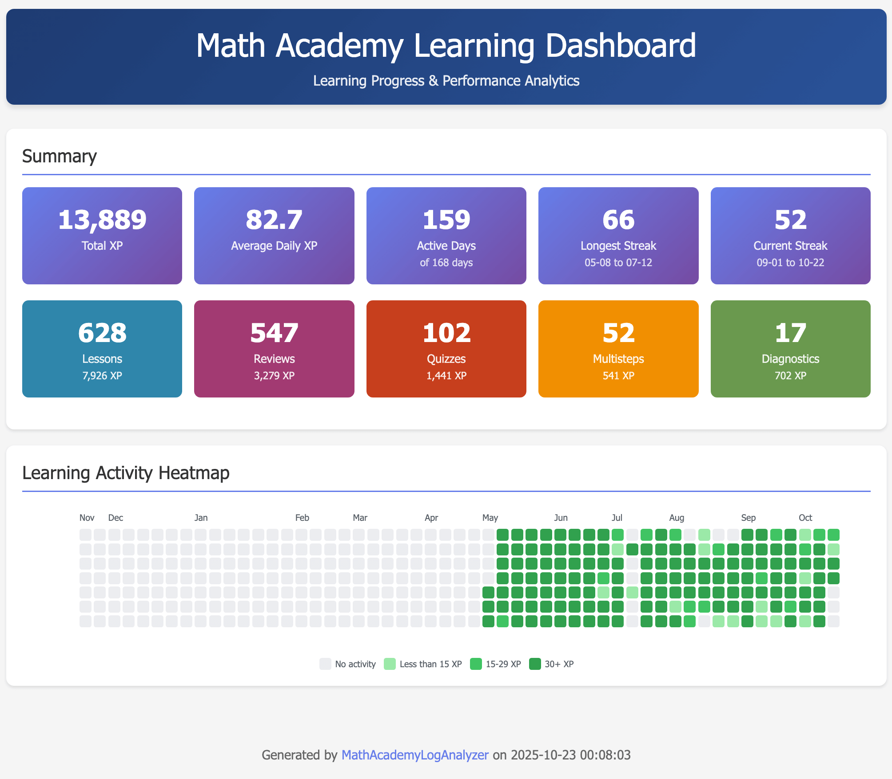
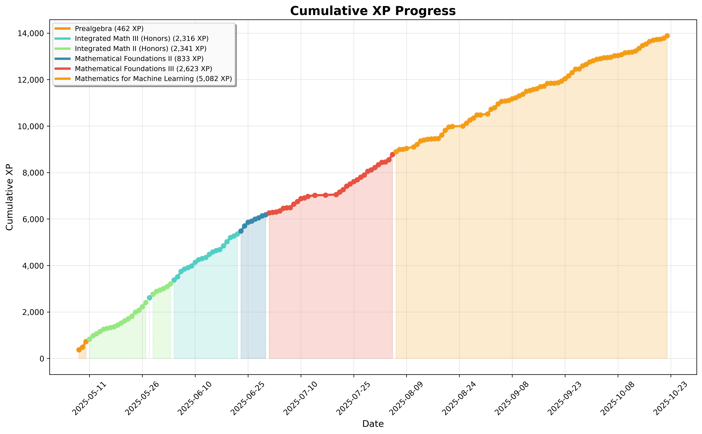
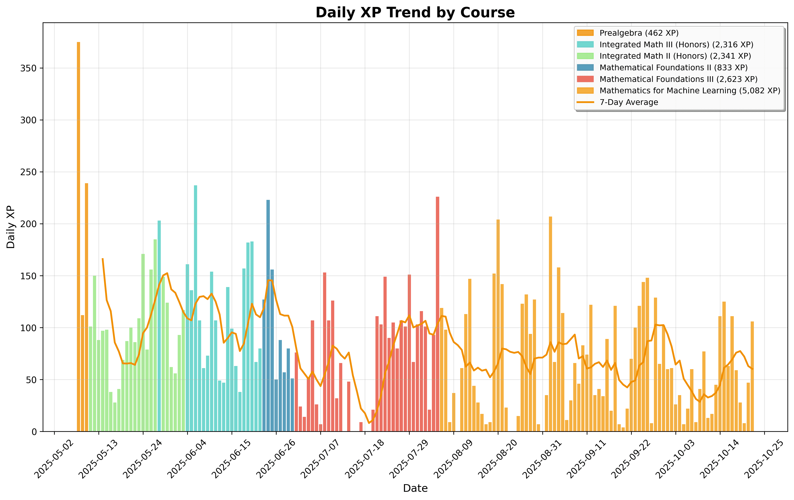
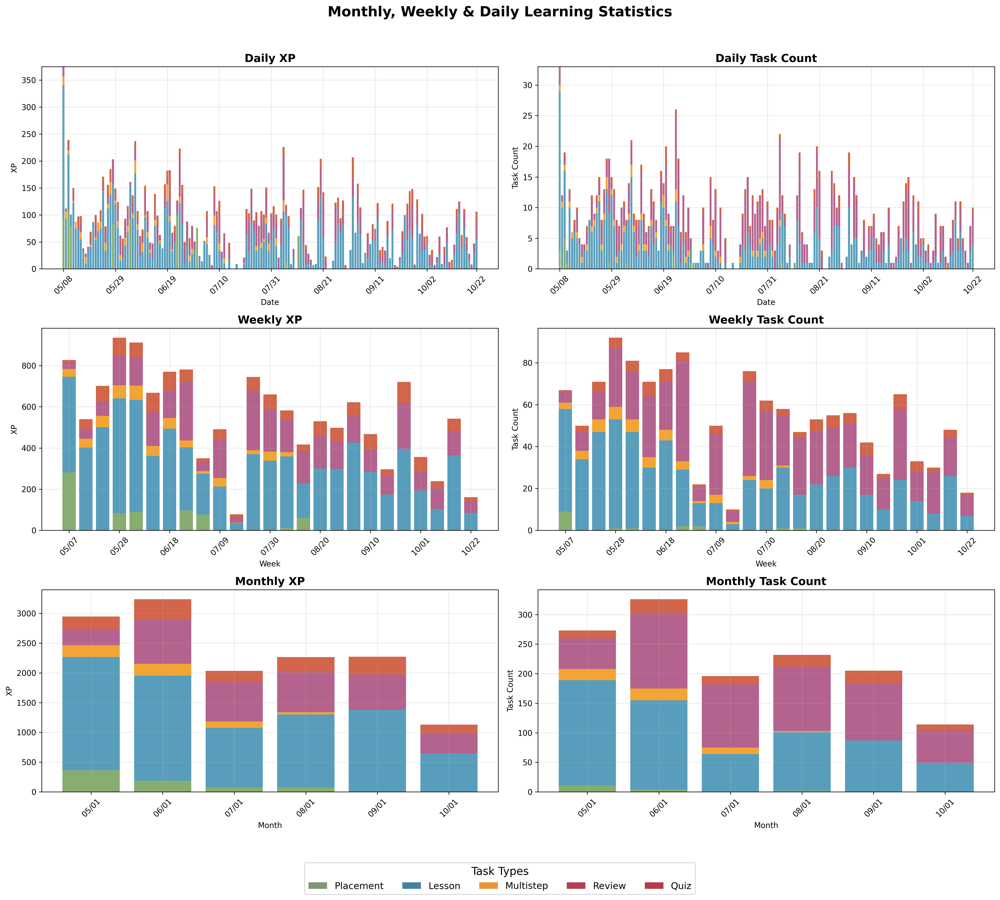
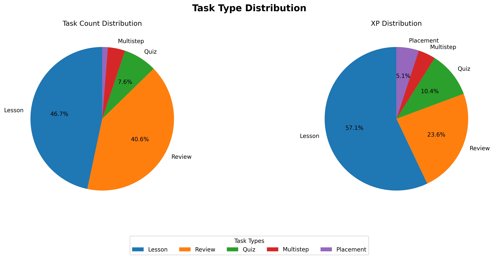
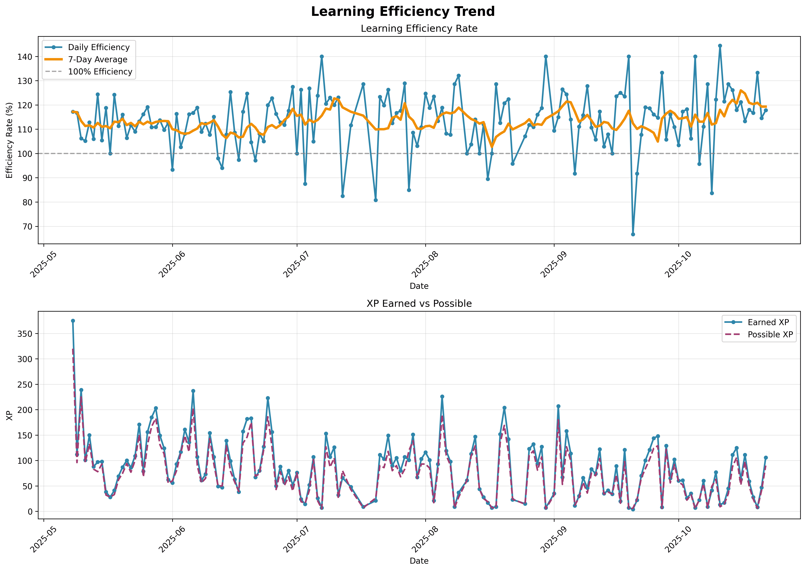
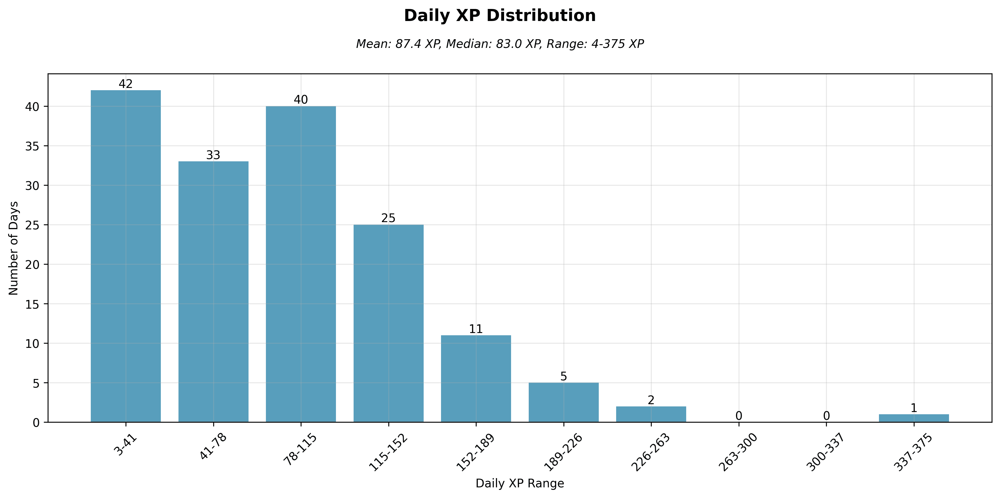
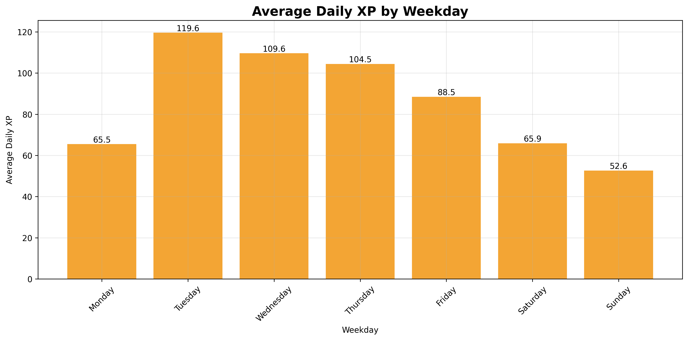

# MathAcademyLogAnalyzer

MathAcademyLogAnalyzer is a Python tool for analyzing course progress data from mathacademy.com's PDF activity logs, built with Claude Code.

Generate charts and statistics from your Math Academy activity logs to track learning progress and identify patterns.

*Inspired by [rng.eth](https://x.com/crackedmonk/status/1962663418089107666)*

[中文文档](README_zh.md)

## 📊 Chart Gallery

### Learning Dashboard


### Learning Progress Analysis
#### Cumulative XP Trend


#### Daily XP Distribution


#### Multi-Level Statistics


#### Task Type Distribution


#### Efficiency Trend


#### Daily XP Histogram


#### Weekday Performance


---

## Quick Start

### 1. Install
```bash
# Clone and install
git clone https://github.com/xmonkey/MathAcademyLogAnalyzer.git
cd MathAcademyLogAnalyzer
pip install -e .
```

**Windows users:**
```cmd
pip install -e .
```

### 2. Download Activity Log PDF
1. Log in to [mathacademy.com](https://mathacademy.com) with your parent/supervisor account
2. Click the student's settings icon (⚙️) next to their name
3. Select "Documentation" from the menu
4. Under "Activity Log", click "Request..."
5. **Important**: Set time frame to include your entire learning period (recommended: from first day)
6. Click "Preview" → Download the PDF file

### 3. Analyze
```bash
mathacademy-analyzer generate-all activity_log.pdf -o output_folder
```

## Output Formats
- **Interactive HTML** (default): Interactive charts with zoom, hover, and tooltips
- **Static PNG**: Static image files suitable for documents and sharing
- **Excel**: Structured data with course details and activity logs
- **JSON**: Raw data for custom analysis

## More Useful Commands
```bash
# Get PDF information
mathacademy-analyzer info activity_log.pdf

# Extract text or tables
mathacademy-analyzer text activity_log.pdf
mathacademy-analyzer tables activity_log.pdf

# Search content
mathacademy-analyzer search activity_log.pdf "search term"

# Generate specific chart types
mathacademy-analyzer chart data.json --chart-type xp
mathacademy-analyzer chart data.json --chart-type dashboard
```

## Global Installation (Optional)

Install from any directory to use globally:

```bash
cd MathAcademyLogAnalyzer
python3 -m pip install -e .
```

## Upgrade

```bash
# Get latest code
git pull

# Reinstall
pip install -e .
```

## Troubleshooting

**Command not found?**
```bash
# Remove old version first
pip uninstall MathAcademyLogAnalyzer -y

# Reinstall
python3 -m pip install -e .
```

---

## Additional Resources

For different approaches to Math Academy data analysis with alternative data sources and content perspectives:

**[rahimnathwani/mathacademy-stats](https://github.com/rahimnathwani/mathacademy-stats)** - Alternative Math Academy statistics and analysis tools

---

*Documentation optimized with Claude Code*