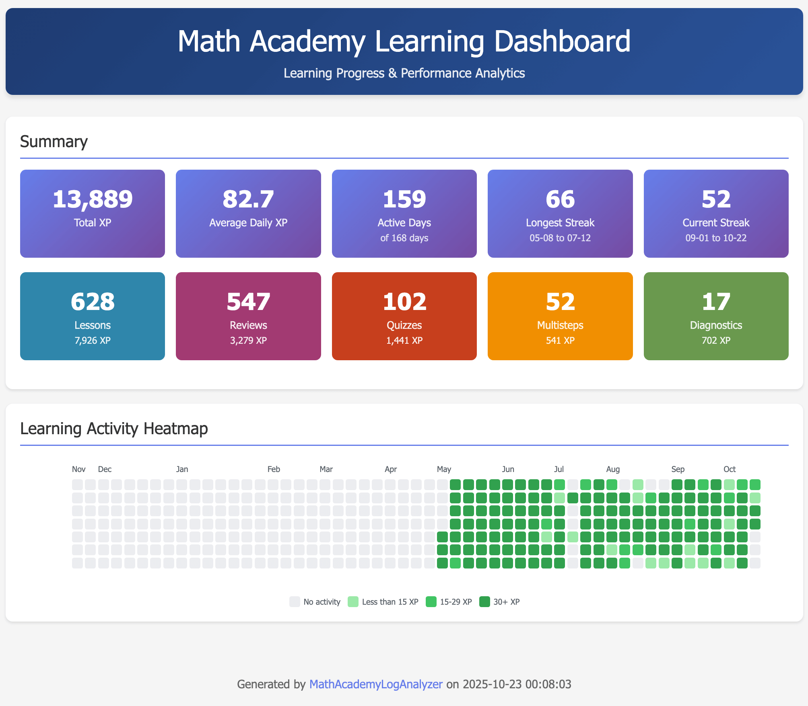
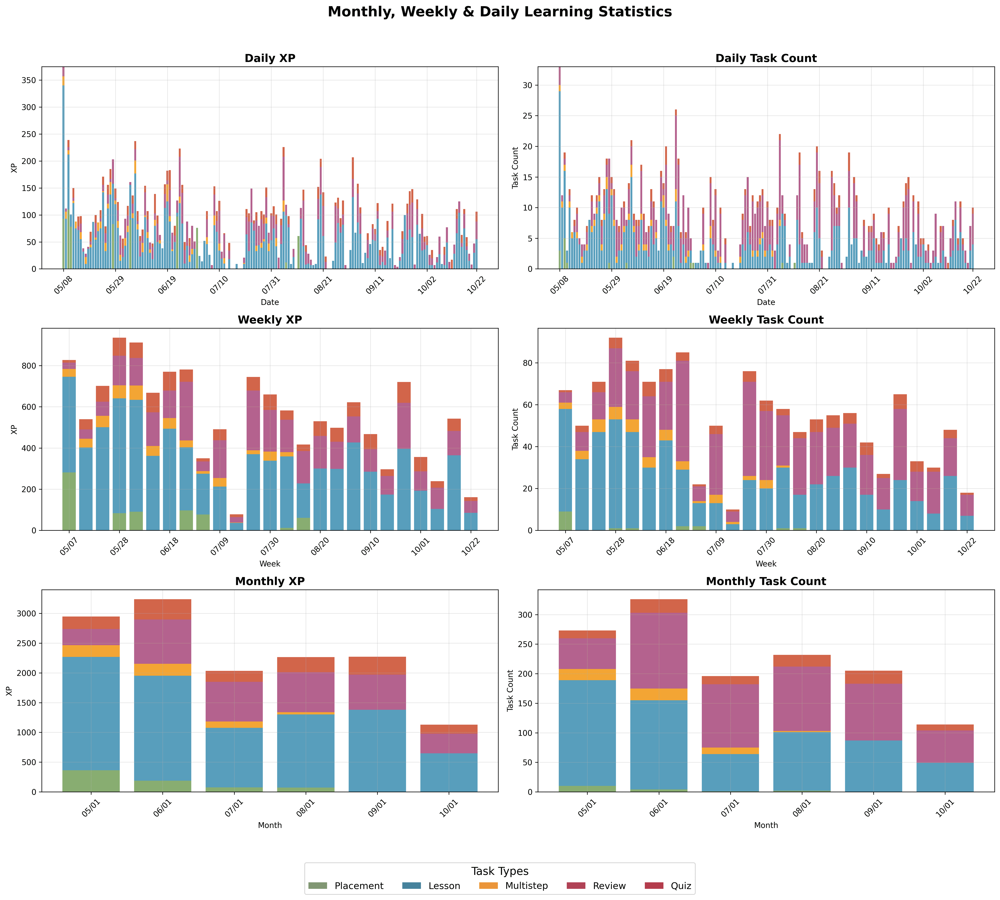
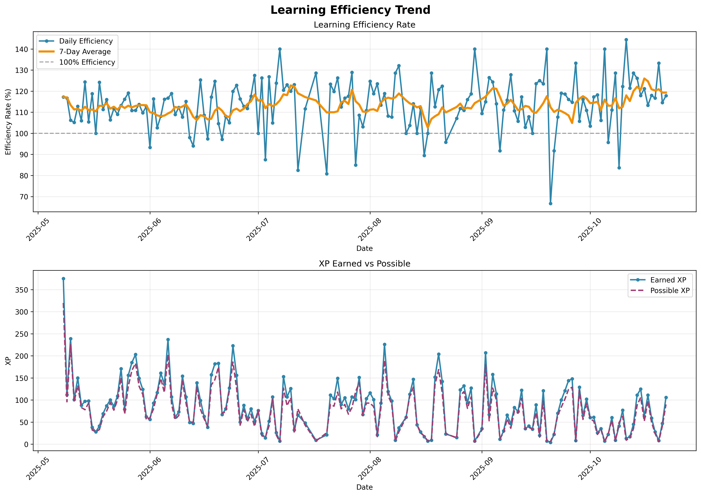
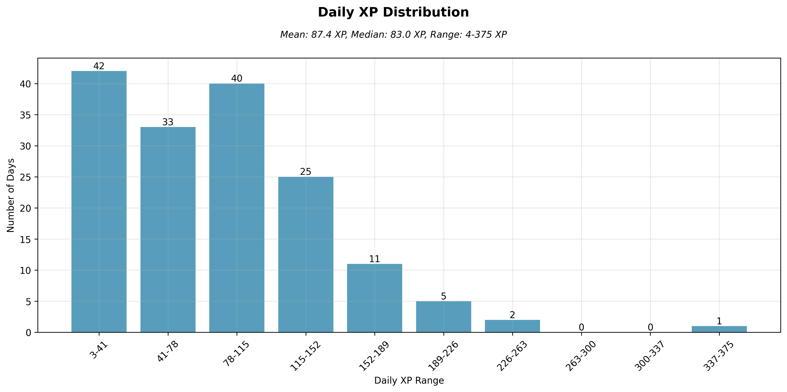

# MathAcademyLogAnalyzer

MathAcademyLogAnalyzer 是一个用于分析 mathacademy.com PDF 活动日志中课程进度数据的 Python 工具，由 Claude Code 构建。

从您的 Math Academy 活动日志中生成图表和统计数据，以跟踪学习进度并识别模式。

*灵感来源于 [rng.eth](https://x.com/crackedmonk/status/1962663418089107666)*

[English Documentation](README.md)

## 📊 图表展示

### 学习仪表板


### 学习进度分析
#### 累积 XP 趋势


#### 每日 XP 分布


#### 多层级统计


#### 任务类型分布


#### 效率趋势


#### 每日 XP 直方图


#### 工作日表现


---

## 快速开始

### 1. 安装
```bash
# 克隆并安装
git clone <repository-url>
cd MathAcademyLogAnalyzer
python -m venv venv
source venv/bin/activate  # Windows: venv\Scripts\activate
pip install -e .
```

### 2. 下载活动日志 PDF
1. 使用家长/监督员账户登录 [mathacademy.com](https://mathacademy.com)
2. 点击学生姓名旁的设置图标 (⚙️)
3. 从菜单中选择 "Documentation"
4. 在 "Activity Log" 下点击 "Request..."
5. **重要**：设置时间范围以包含您的整个学习期间（建议：从第一天开始）
6. 点击 "Preview" → 下载 PDF 文件

### 3. 分析并生成图表
```bash
mathacademy-analyzer generate-all activity_log.pdf -o output_folder
```

## 输出格式
- **交互式HTML**（默认）：支持缩放、悬停和提示的交互图表
- **静态PNG**：适合文档和分享的静态图片文件
- **Excel**：包含课程详情和活动日志的结构化数据
- **JSON**：用于自定义分析的原始数据

## 更多实用命令
```bash
# 获取 PDF 信息
mathacademy-analyzer info activity_log.pdf

# 提取文本或表格
mathacademy-analyzer text activity_log.pdf
mathacademy-analyzer tables activity_log.pdf

# 搜索内容
mathacademy-analyzer search activity_log.pdf "搜索词"

# 生成特定类型的图表
mathacademy-analyzer chart data.json --chart-type cumulative_xp
mathacademy-analyzer chart data.json --chart-type dashboard
```

---

## 其他资源

对于不同的 Math Academy 数据分析方法，具有不同的数据来源和内容视角：

**[rahimnathwani/mathacademy-stats](https://github.com/rahimnathwani/mathacademy-stats)** - 补充性分析工具，使用不同的数据提取方法，提供PDF活动日志之外的额外洞察

---

*文档由 Claude Code 优化*